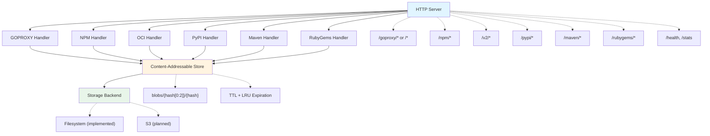

# content-cache

A content-addressable caching proxy for Go modules, NPM packages, PyPI packages, Maven artifacts, RubyGems, and OCI registries. Reduces build times and network bandwidth by caching package downloads locally with automatic deduplication and expiration policies.

## Problem

Development teams waste significant time and bandwidth re-downloading the same packages across builds, CI runs, and developer machines. A single `go mod download` or `npm install` can fetch hundreds of megabytes that were already downloaded yesterday. Network failures during package downloads break builds unpredictably.

## Solution

content-cache acts as a local caching proxy that:
- Stores packages once using content-addressable storage (BLAKE3 hashing)
- Serves cached packages in microseconds instead of milliseconds
- Deduplicates identical content across different package versions
- Continues serving cached packages when upstream registries are unavailable

## Quick Start

```bash
# Build and run the cache server
go build -o content-cache ./cmd/content-cache
./content-cache -address :8080 -storage ./cache

# Configure Go to use the cache (option 1: with /goproxy prefix)
export GOPROXY=http://localhost:8080/goproxy,direct

# Or use directly at root (option 2: no prefix needed)
# export GOPROXY=http://localhost:8080,direct

# Downloads are now cached locally
go get github.com/pkg/errors@v0.9.1  # First request: ~12ms (upstream)
go get github.com/pkg/errors@v0.9.1  # Second request: ~100µs (cache hit)

# Configure NPM to use the cache
npm config set registry http://localhost:8080/npm/

# NPM packages are now cached
npm install express  # First request: fetches from upstream
npm install express  # Second request: served from cache

# Use as an OCI registry mirror
docker pull localhost:8080/library/alpine:latest

# Configure pip to use the cache
pip install --index-url http://localhost:8080/pypi/simple/ requests

# Python packages are now cached
pip install requests  # First request: fetches from upstream
pip install requests  # Second request: served from cache

# Configure Maven to use the cache
# Create ~/.m2/settings.xml with:
#
# <?xml version="1.0" encoding="UTF-8"?>
# <settings xmlns="http://maven.apache.org/SETTINGS/1.2.0"
#           xmlns:xsi="http://www.w3.org/2001/XMLSchema-instance"
#           xsi:schemaLocation="http://maven.apache.org/SETTINGS/1.2.0 https://maven.apache.org/xsd/settings-1.2.0.xsd">
#   <mirrors>
#     <mirror>
#       <id>content-cache</id>
#       <mirrorOf>central</mirrorOf>
#       <url>http://localhost:8080/maven</url>
#     </mirror>
#   </mirrors>
# </settings>

# Maven artifacts are now cached
mvn dependency:get -Dartifact=org.apache.commons:commons-lang3:3.12.0

# Configure Gradle to use the cache (in settings.gradle.kts or build.gradle.kts)
# repositories {
#     maven {
#         url = uri("http://localhost:8080/maven")
#     }
# }

# Gradle uses the same Maven repository protocol - no separate handler needed
./gradlew build  # Dependencies are cached through the Maven endpoint

# Configure Bundler to use the cache (global mirror)
bundle config set --global mirror.https://rubygems.org http://localhost:8080/rubygems/

# Or configure gem command directly
gem sources --add http://localhost:8080/rubygems/
gem sources --remove https://rubygems.org/

# Ruby gems are now cached
bundle install   # First request: fetches from upstream
bundle install   # Second request: served from cache
```

## Performance

| Operation | Upstream | Cached | Improvement |
|-----------|----------|--------|-------------|
| Module info | 12ms | 100µs | 120x faster |
| Module zip | 150ms | 1ms | 150x faster |

## Current Features

### Implemented
- **GOPROXY Protocol**: Full support for Go module proxy protocol (`/@v/list`, `.info`, `.mod`, `.zip`)
- **NPM Registry Protocol**: Complete NPM registry support with tarball caching and integrity verification
- **PyPI Simple API**: Full support for PEP 503/691 Simple Repository API with wheel and sdist caching
- **Maven Repository**: Full support for Maven Central with JAR, POM, and checksum caching
- **RubyGems Registry**: Full support for Compact Index and legacy specs API with gem caching and SHA256 verification
- **OCI Distribution v2**: Read-through cache for container registries with tag-to-digest resolution
- **Content-Addressable Storage**: BLAKE3 hashing with automatic deduplication
- **Filesystem Backend**: Atomic writes with sharded directory structure
- **Pull-Through Caching**: Fetches from upstream on cache miss, caches for future requests
- **Cache Expiration**: TTL-based and size-based (LRU) eviction with configurable intervals
- **Authentication**: Support for OCI registry authentication with username/password
- **Health & Stats Endpoints**: `/health` for liveness checks, `/stats` for cache statistics
- **OpenTelemetry Metrics**: Request counts, bytes served, and latency histograms with cache hit/miss breakdown
- **Prometheus Integration**: Optional `/metrics` endpoint for Prometheus scraping
- **Structured Logging**: JSON logs with protocol, endpoint, cache_result, and timing fields

### Planned
- S3 storage backend
- Compression (zstd)
- OpenTelemetry tracing

## Architecture



## Configuration

All configuration options are provided via command-line flags:

### Server Options
```bash
-address :8080              # HTTP server listen address
-storage ./cache            # Local storage directory path
```

### Upstream Registry Options
```bash
-go-upstream ""             # Upstream Go module proxy URL (default: proxy.golang.org)
-npm-upstream ""            # Upstream NPM registry URL (default: registry.npmjs.org)
-oci-upstream ""            # Upstream OCI registry URL (default: registry-1.docker.io)
-pypi-upstream ""           # Upstream PyPI Simple API URL (default: pypi.org/simple/)
-maven-upstream ""          # Upstream Maven repository URL (default: repo.maven.apache.org/maven2)
-rubygems-upstream ""       # Upstream RubyGems registry URL (default: rubygems.org)
```

### OCI Authentication
```bash
-oci-username ""            # OCI registry username for authentication
-oci-password ""            # OCI registry password for authentication
-oci-tag-ttl 5m             # TTL for OCI tag->digest cache mappings
```

### PyPI Options
```bash
-pypi-metadata-ttl 5m       # TTL for PyPI project metadata cache
```

### Maven Options
```bash
-maven-upstream ""          # Upstream Maven repository URL (default: repo.maven.apache.org/maven2)
-maven-metadata-ttl 5m      # TTL for maven-metadata.xml cache
```

### RubyGems Options
```bash
-rubygems-upstream ""       # Upstream RubyGems registry URL (default: rubygems.org)
-rubygems-metadata-ttl 5m   # TTL for RubyGems metadata cache (versions, info, specs)
```

### Cache Management
```bash
-cache-ttl 168h             # Cache TTL (e.g., 168h for 7 days, 0 to disable)
-cache-max-size 10737418240 # Maximum cache size in bytes (default: 10GB, 0 to disable)
-expiry-check-interval 1h   # How often to check for expired content
```

### Logging Options
```bash
-log-level info             # Log level: debug, info, warn, error
-log-format text            # Log format: text, json
```

### Metrics Options
```bash
-metrics-otlp-endpoint ""   # OTLP gRPC endpoint for metrics export (e.g., localhost:4317)
-metrics-prometheus         # Enable Prometheus /metrics endpoint
-metrics-interval 10s       # Metrics export interval
```

### Example: Full Configuration

```bash
./content-cache \
  -address :8080 \
  -storage /var/cache/content-cache \
  -go-upstream https://proxy.golang.org \
  -npm-upstream https://registry.npmjs.org \
  -oci-upstream https://registry-1.docker.io \
  -oci-username myuser \
  -oci-password mypassword \
  -oci-tag-ttl 10m \
  -pypi-upstream https://pypi.org/simple/ \
  -pypi-metadata-ttl 10m \
  -maven-upstream https://repo.maven.apache.org/maven2 \
  -maven-metadata-ttl 10m \
  -rubygems-upstream https://rubygems.org \
  -rubygems-metadata-ttl 10m \
  -cache-ttl 336h \
  -cache-max-size 21474836480 \
  -expiry-check-interval 30m \
  -log-level debug \
  -log-format json \
  -metrics-prometheus \
  -metrics-otlp-endpoint otel-collector:4317
```

## Storage Layout

```
./cache/
├── blobs/                   # Content-addressable storage
│   └── 58/                  # Sharded by first 2 hex digits of hash
│       └── 5818f08e...      # Full BLAKE3 hash as filename
├── goproxy/                 # Go module index
│   └── github.com/
│       └── pkg/
│           └── errors/
│               └── @v/
│                   ├── list          # Available versions
│                   ├── v0.9.1.info   # Version metadata
│                   └── v0.9.1.mod    # go.mod content
├── npm/                     # NPM package index
│   └── express/
│       ├── metadata.json    # Package metadata
│       └── versions/
│           └── 4.18.2/
│               └── tarball  # Reference to blob
├── pypi/                    # PyPI package index
│   └── projects/
│       └── requests/
│           └── metadata.json  # Project files and hashes
├── maven/                   # Maven artifact index
│   ├── metadata/
│   │   └── org/apache/commons/
│   │       └── commons-lang3/
│   │           └── metadata.json  # maven-metadata.xml cache
│   └── artifacts/
│       └── org/apache/commons/
│           └── commons-lang3/
│               └── 3.12.0/
│                   └── commons-lang3-3.12.0.jar.json  # Artifact reference
├── rubygems/                # RubyGems index
│   ├── versions.json        # Cached /versions metadata
│   ├── versions             # Raw /versions file content
│   ├── info/
│   │   └── rails.json       # Per-gem metadata with checksums
│   ├── specs/
│   │   └── specs.4.8.gz     # Legacy specs files
│   └── gems/
│       └── rails-7.1.0.gem.json  # Gem file references
└── oci/                     # OCI image index
    └── library/
        └── alpine/
            ├── manifests/
            │   └── sha256:abc...    # Image manifests
            └── blobs/
                └── sha256:def...    # Layer references
```

## Development

```bash
# Run tests
go test ./...

# Run with debug logging
./content-cache -log-level debug

# Test the Go proxy endpoint
curl http://localhost:8080/goproxy/github.com/pkg/errors/@v/v0.9.1.info

# Test the NPM registry endpoint
curl http://localhost:8080/npm/express

# Test the PyPI Simple API endpoint
curl http://localhost:8080/pypi/simple/requests/

# Test the Maven repository endpoint
curl http://localhost:8080/maven/org/apache/commons/commons-lang3/maven-metadata.xml

# Test the RubyGems registry endpoint (Compact Index)
curl http://localhost:8080/rubygems/versions
curl http://localhost:8080/rubygems/info/rails

# Test the OCI registry endpoint
curl http://localhost:8080/v2/

# Health check
curl http://localhost:8080/health

# Check cache statistics (requires cache-ttl or cache-max-size to be set)
curl http://localhost:8080/stats

# View cached content size on disk
ls -lh ./cache/blobs/
```

## Metrics & Observability

content-cache exports OpenTelemetry metrics for monitoring cache effectiveness.

### Metrics Exported

| Metric | Type | Description |
|--------|------|-------------|
| `content_cache_http_requests_total` | Counter | Total requests by protocol, endpoint, cache_result, status |
| `content_cache_http_response_bytes_total` | Counter | Bytes served by protocol, endpoint, cache_result, status |
| `content_cache_http_request_duration_seconds` | Histogram | Request latency by protocol, endpoint, cache_result, status |

### Labels

- `protocol`: npm, pypi, goproxy, maven, rubygems, oci
- `endpoint`: metadata, tarball, artifact, blob, manifest, etc.
- `cache_result`: hit, miss, bypass
- `status_class`: 2xx, 3xx, 4xx, 5xx

### Example Queries (PromQL)

```promql
# Cache hit rate by protocol
sum(rate(content_cache_http_requests_total{cache_result="hit"}[5m])) by (protocol)
/ sum(rate(content_cache_http_requests_total{cache_result=~"hit|miss"}[5m])) by (protocol)

# Bandwidth served from cache (bytes/sec)
sum(rate(content_cache_http_response_bytes_total{cache_result="hit"}[5m]))

# P95 latency comparison: cache hits vs misses
histogram_quantile(0.95, 
  sum(rate(content_cache_http_request_duration_seconds_bucket[5m])) by (le, cache_result)
)

# Total bandwidth saved (approximate, cumulative)
sum(content_cache_http_response_bytes_total{cache_result="hit"})
```

### Structured Logging

With `-log-format json`, logs include fields for analysis:

```json
{
  "level": "INFO",
  "msg": "http request",
  "protocol": "npm",
  "endpoint": "tarball",
  "cache_result": "hit",
  "status": 200,
  "status_class": "2xx",
  "bytes_sent": 528640,
  "duration_ms": 12,
  "request_id": "550e8400-e29b-41d4-a716-446655440000"
}
```

## Goals

- Simple and efficient content storage and retrieval
- Automatic deduplication (same content stored once)
- Content retrieval by BLAKE3 hash
- Multiple storage backends (filesystem, S3)
- TTL and LRU-based expiration
- Compression support
- Observability (metrics, traces, logs)

## Disclosure

This project was developed with AI, specifically Claude, from [Anthropic](https://www.anthropic.com/).

## License

Apache License, Version 2.0 - Copyright [Mark Wolfe](https://www.wolfe.id.au)
