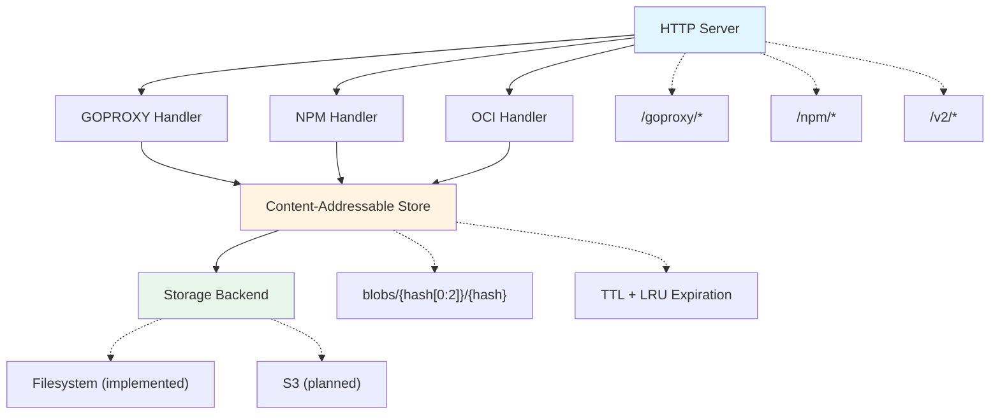

# content-cache

A content-addressable caching proxy for Go modules, NPM packages, and OCI registries. Reduces build times and network bandwidth by caching package downloads locally with automatic deduplication and expiration policies.

## Problem

Development teams waste significant time and bandwidth re-downloading the same packages across builds, CI runs, and developer machines. A single `go mod download` or `npm install` can fetch hundreds of megabytes that were already downloaded yesterday. Network failures during package downloads break builds unpredictably.

## Solution

content-cache acts as a local caching proxy that:
- Stores packages once using content-addressable storage (BLAKE3 hashing)
- Serves cached packages in microseconds instead of milliseconds
- Deduplicates identical content across different package versions
- Continues serving cached packages when upstream registries are unavailable

## Quick Start

```bash
# Build and run the cache server
go build -o content-cache ./cmd/content-cache
./content-cache -address :8080 -storage ./cache

# Configure Go to use the cache
export GOPROXY=http://localhost:8080/goproxy,direct

# Downloads are now cached locally
go get github.com/pkg/errors@v0.9.1  # First request: ~12ms (upstream)
go get github.com/pkg/errors@v0.9.1  # Second request: ~100µs (cache hit)

# Configure NPM to use the cache
npm config set registry http://localhost:8080/npm/

# NPM packages are now cached
npm install express  # First request: fetches from upstream
npm install express  # Second request: served from cache

# Use as an OCI registry mirror
docker pull localhost:8080/library/alpine:latest
```

## Performance

| Operation | Upstream | Cached | Improvement |
|-----------|----------|--------|-------------|
| Module info | 12ms | 100µs | 120x faster |
| Module zip | 150ms | 1ms | 150x faster |

## Current Features

### Implemented
- **GOPROXY Protocol**: Full support for Go module proxy protocol (`/@v/list`, `.info`, `.mod`, `.zip`)
- **NPM Registry Protocol**: Complete NPM registry support with tarball caching and integrity verification
- **OCI Distribution v2**: Read-through cache for container registries with tag-to-digest resolution
- **Content-Addressable Storage**: BLAKE3 hashing with automatic deduplication
- **Filesystem Backend**: Atomic writes with sharded directory structure
- **Pull-Through Caching**: Fetches from upstream on cache miss, caches for future requests
- **Cache Expiration**: TTL-based and size-based (LRU) eviction with configurable intervals
- **Authentication**: Support for OCI registry authentication with username/password

### Planned
- S3 storage backend
- Compression (zstd)
- Metrics and tracing (OpenTelemetry)

## Architecture



## Configuration

All configuration options are provided via command-line flags:

### Server Options
```bash
-address :8080              # HTTP server listen address
-storage ./cache            # Local storage directory path
```

### Upstream Registry Options
```bash
-go-upstream ""             # Upstream Go module proxy URL (default: proxy.golang.org)
-npm-upstream ""            # Upstream NPM registry URL (default: registry.npmjs.org)
-oci-upstream ""            # Upstream OCI registry URL (default: registry-1.docker.io)
```

### OCI Authentication
```bash
-oci-username ""            # OCI registry username for authentication
-oci-password ""            # OCI registry password for authentication
-oci-tag-ttl 5m             # TTL for OCI tag->digest cache mappings
```

### Cache Management
```bash
-cache-ttl 168h             # Cache TTL (e.g., 168h for 7 days, 0 to disable)
-cache-max-size 10737418240 # Maximum cache size in bytes (default: 10GB, 0 to disable)
-expiry-check-interval 1h   # How often to check for expired content
```

### Logging Options
```bash
-log-level info             # Log level: debug, info, warn, error
-log-format text            # Log format: text, json
```

### Example: Full Configuration

```bash
./content-cache \
  -address :8080 \
  -storage /var/cache/content-cache \
  -go-upstream https://proxy.golang.org \
  -npm-upstream https://registry.npmjs.org \
  -oci-upstream https://registry-1.docker.io \
  -oci-username myuser \
  -oci-password mypassword \
  -oci-tag-ttl 10m \
  -cache-ttl 336h \
  -cache-max-size 21474836480 \
  -expiry-check-interval 30m \
  -log-level debug \
  -log-format json
```

## Storage Layout

```
./cache/
├── blobs/                   # Content-addressable storage
│   └── 58/                  # Sharded by first 2 hex digits of hash
│       └── 5818f08e...      # Full BLAKE3 hash as filename
├── goproxy/                 # Go module index
│   └── github.com/
│       └── pkg/
│           └── errors/
│               └── @v/
│                   ├── list          # Available versions
│                   ├── v0.9.1.info   # Version metadata
│                   └── v0.9.1.mod    # go.mod content
├── npm/                     # NPM package index
│   └── express/
│       ├── metadata.json    # Package metadata
│       └── versions/
│           └── 4.18.2/
│               └── tarball  # Reference to blob
└── oci/                     # OCI image index
    └── library/
        └── alpine/
            ├── manifests/
            │   └── sha256:abc...    # Image manifests
            └── blobs/
                └── sha256:def...    # Layer references
```

## Development

```bash
# Run tests
go test ./...

# Run with debug logging
./content-cache -log-level debug

# Test the Go proxy endpoint
curl http://localhost:8080/goproxy/github.com/pkg/errors/@v/v0.9.1.info

# Test the NPM registry endpoint
curl http://localhost:8080/npm/express

# Test the OCI registry endpoint
curl http://localhost:8080/v2/

# Check cache statistics
ls -lh ./cache/blobs/  # View cached content size
```

## Goals

- Simple and efficient content storage and retrieval
- Automatic deduplication (same content stored once)
- Content retrieval by BLAKE3 hash
- Multiple storage backends (filesystem, S3)
- TTL and LRU-based expiration
- Compression support
- Observability (metrics, traces, logs)

## Disclosure

This project was developed with AI, specifically Claude, from [Anthropic](https://www.anthropic.com/).

## License

Apache License, Version 2.0 - Copyright [Mark Wolfe](https://www.wolfe.id.au)
