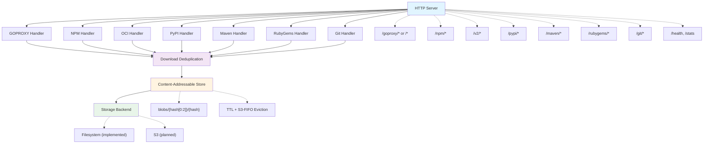

# content-cache

A content-addressable caching proxy for Go modules, NPM packages, PyPI packages, Maven artifacts, RubyGems, OCI registries, and Git repositories. Reduces build times and network bandwidth by caching package downloads locally with automatic deduplication and expiration policies.

## Problem

Development teams waste significant time and bandwidth re-downloading the same packages across builds, CI runs, and developer machines. A single `go mod download` or `npm install` can fetch hundreds of megabytes that were already downloaded yesterday. Network failures during package downloads break builds unpredictably.

## Solution

content-cache acts as a local caching proxy that:
- Stores packages once using content-addressable storage (BLAKE3 hashing)
- Serves cached packages in microseconds instead of milliseconds
- Deduplicates identical content across different package versions
- Coalesces concurrent requests for the same uncached resource into a single upstream fetch
- Continues serving cached packages when upstream registries are unavailable

## S3-FIFO Cache Eviction

Based on [FIFO Queues are All You Need for Cache Eviction (CMU-CS-24-149)](https://www.pdl.cmu.edu/ftp/Storage/CMU-CS-24-149-juncheny.pdf).

## Quick Start

```bash
# Build and run the cache server
go build -o content-cache ./cmd/content-cache
./content-cache serve --listen :8080 --storage ./cache

# Configure Go to use the cache (option 1: with /goproxy prefix)
export GOPROXY=http://localhost:8080/goproxy,direct

# Or use directly at root (option 2: no prefix needed)
# export GOPROXY=http://localhost:8080,direct

# Downloads are now cached locally
go get github.com/pkg/errors@v0.9.1  # First request: ~12ms (upstream)
go get github.com/pkg/errors@v0.9.1  # Second request: ~100µs (cache hit)

# Configure NPM to use the cache
npm config set registry http://localhost:8080/npm/

# NPM packages are now cached
npm install express  # First request: fetches from upstream
npm install express  # Second request: served from cache

# Use as an OCI registry mirror (prefix-based routing, default prefix: docker-hub)
docker pull localhost:8080/docker-hub/library/alpine:latest

# Configure pip to use the cache
pip install --index-url http://localhost:8080/pypi/simple/ requests

# Python packages are now cached
pip install requests  # First request: fetches from upstream
pip install requests  # Second request: served from cache

# Configure Maven to use the cache
# Create ~/.m2/settings.xml with:
#
# <?xml version="1.0" encoding="UTF-8"?>
# <settings xmlns="http://maven.apache.org/SETTINGS/1.2.0"
#           xmlns:xsi="http://www.w3.org/2001/XMLSchema-instance"
#           xsi:schemaLocation="http://maven.apache.org/SETTINGS/1.2.0 https://maven.apache.org/xsd/settings-1.2.0.xsd">
#   <mirrors>
#     <mirror>
#       <id>content-cache</id>
#       <mirrorOf>central</mirrorOf>
#       <url>http://localhost:8080/maven</url>
#     </mirror>
#   </mirrors>
# </settings>

# Maven artifacts are now cached
mvn dependency:get -Dartifact=org.apache.commons:commons-lang3:3.12.0

# Configure Gradle to use the cache (in settings.gradle.kts or build.gradle.kts)
# repositories {
#     maven {
#         url = uri("http://localhost:8080/maven")
#     }
# }

# Gradle uses the same Maven repository protocol - no separate handler needed
./gradlew build  # Dependencies are cached through the Maven endpoint

# Configure Bundler to use the cache (global mirror)
bundle config set --global mirror.https://rubygems.org http://localhost:8080/rubygems/

# Or configure gem command directly
gem sources --add http://localhost:8080/rubygems/
gem sources --remove https://rubygems.org/

# Ruby gems are now cached
bundle install   # First request: fetches from upstream
bundle install   # Second request: served from cache

# Use as a Git HTTPS caching proxy (requires --git-allowed-hosts)
./content-cache serve --listen :8080 --storage ./cache --git-allowed-hosts github.com

# Clone through the proxy
git clone http://localhost:8080/git/github.com/user/repo.git /tmp/repo

# Repeated clones with the same refs are served from cache
git clone http://localhost:8080/git/github.com/user/repo.git /tmp/repo2  # cache hit

# Or configure Git to transparently route through the proxy
git config --global url."http://localhost:8080/git/github.com/".insteadOf "https://github.com/"

# Now regular git commands work transparently through the cache
git clone https://github.com/user/repo.git  # routed through proxy automatically

# To undo
git config --global --unset url."http://localhost:8080/git/github.com/".insteadOf
```

## Performance

| Operation | Upstream | Cached | Improvement |
|-----------|----------|--------|-------------|
| Module info | 12ms | 100µs | 120x faster |
| Module zip | 150ms | 1ms | 150x faster |

## Current Features

### Implemented
- **GOPROXY Protocol**: Full support for Go module proxy protocol (`/@v/list`, `.info`, `.mod`, `.zip`)
- **NPM Registry Protocol**: Complete NPM registry support with tarball caching and integrity verification
- **PyPI Simple API**: Full support for PEP 503/691 Simple Repository API with wheel and sdist caching
- **Maven Repository**: Full support for Maven Central with JAR, POM, and checksum caching
- **RubyGems Registry**: Full support for Compact Index and legacy specs API with gem caching and SHA256 verification
- **OCI Distribution v2**: Read-through cache for container registries with tag-to-digest resolution
- **Git Smart HTTP Proxy**: Caching proxy for `git clone`/`fetch` over HTTPS with pack-level caching, host allowlist, and singleflight deduplication
- **Content-Addressable Storage**: BLAKE3 hashing with automatic deduplication
- **Filesystem Backend**: Atomic writes with sharded directory structure
- **Download Deduplication**: Singleflight-based coalescing of concurrent requests for the same uncached resource
- **Pull-Through Caching**: Fetches from upstream on cache miss, caches for future requests
- **Cache Expiration**: TTL-based expiration with S3-FIFO size-based eviction (lower miss ratios by filtering one-hit-wonders from polluting the main cache)
- **Inbound Authentication**: Bearer token auth middleware protecting all endpoints (except `/health` and `/metrics`), configurable via `--auth-token` or `--auth-token-file`
- **Upstream Credentials**: Template-based credentials file (`--credentials-file`) with routing tables for per-scope (NPM) and per-repo-prefix (Git) credential selection, plus multi-registry OCI auth. Supports pluggable secret providers (environment variables, files, 1Password CLI)
- **Routing Tables**: NPM scope-based and Git repo-prefix-based routing with catch-all fallback, validated at startup
- **Health & Stats Endpoints**: `/health` for liveness checks, `/stats` for cache statistics
- **OpenTelemetry Metrics**: Request counts, bytes served, and latency histograms with cache hit/miss breakdown
- **Prometheus Integration**: Optional `/metrics` endpoint for Prometheus scraping
- **Structured Logging**: JSON logs with protocol, endpoint, cache_result, and timing fields

### Planned
- S3 storage backend
- Compression (zstd)
- OpenTelemetry tracing

## Architecture



## Configuration

Configuration is available via command-line flags or environment variables. Environment variables take precedence over defaults but are overridden by explicit flags.

### Server Options

| Flag | Environment Variable | Default | Description |
|------|---------------------|---------|-------------|
| `--listen` | `LISTEN_ADDRESS` | `:8080` | HTTP server listen address |
| `--storage` | `CACHE_STORAGE` | `./cache` | Local storage directory path |
| `--tls-cert` | `TLS_CERT_FILE` | | Path to TLS certificate file (enables HTTPS) |
| `--tls-key` | `TLS_KEY_FILE` | | Path to TLS private key file (enables HTTPS) |

### Authentication Options

| Flag | Environment Variable | Default | Description |
|------|---------------------|---------|-------------|
| `--auth-token` | `AUTH_TOKEN` | | Bearer token for inbound authentication |
| `--auth-token-file` | `AUTH_TOKEN_FILE` | | Path to file containing auth token (for k8s secret mounts) |
| `--credentials-file` | `CREDENTIALS_FILE` | | Path to credentials template file for upstream auth |

When `--auth-token` is set, all requests (except `/health` and `/metrics`) require an `Authorization: Bearer <token>` header. The token can also be provided via the `auth_token` field in the credentials file; the CLI flag takes precedence.

When `--credentials-file` is set, the file is parsed as a Go template that produces JSON. Template functions resolve secrets from environment variables (`env`), files (`file`), or external stores like 1Password CLI (`op`). See the [Credentials File](#credentials-file) section for the full schema.

### Upstream Registry Options

| Flag | Environment Variable | Default | Description |
|------|---------------------|---------|-------------|
| `--go-upstream` | `GO_UPSTREAM` | `proxy.golang.org` | Upstream Go module proxy URL |
| `--npm-upstream` | `NPM_UPSTREAM` | `registry.npmjs.org` | Upstream NPM registry URL |
| `--oci-upstream` | `OCI_UPSTREAM` | `registry-1.docker.io` | Upstream OCI registry URL |
| `--pypi-upstream` | `PYPI_UPSTREAM` | `pypi.org/simple/` | Upstream PyPI Simple API URL |
| `--maven-upstream` | `MAVEN_UPSTREAM` | `repo.maven.apache.org/maven2` | Upstream Maven repository URL |
| `--rubygems-upstream` | `RUBYGEMS_UPSTREAM` | `rubygems.org` | Upstream RubyGems registry URL |

### OCI Options

| Flag | Environment Variable | Default | Description |
|------|---------------------|---------|-------------|
| `--oci-prefix` | `OCI_PREFIX` | `docker-hub` | Routing prefix for the OCI registry (appears in URL path as `/v2/{prefix}/...`) |
| `--oci-tag-ttl` | `OCI_TAG_TTL` | `5m` | TTL for OCI tag→digest cache mappings |

OCI registry credentials (username/password) are configured via the credentials file. When the credentials file defines `oci.registries[]`, the `--oci-upstream` and `--oci-prefix` CLI flags are ignored.

### Metadata TTL Options

| Flag | Environment Variable | Default | Description |
|------|---------------------|---------|-------------|
| `--pypi-metadata-ttl` | `PYPI_METADATA_TTL` | `5m` | TTL for PyPI project metadata cache |
| `--maven-metadata-ttl` | `MAVEN_METADATA_TTL` | `5m` | TTL for maven-metadata.xml cache |
| `--rubygems-metadata-ttl` | `RUBYGEMS_METADATA_TTL` | `5m` | TTL for RubyGems metadata cache |

### Git Proxy Options

| Flag | Environment Variable | Default | Description |
|------|---------------------|---------|-------------|
| `--git-allowed-hosts` | `GIT_ALLOWED_HOSTS` | | Comma-separated list of allowed Git upstream hosts (e.g., `github.com,gitlab.com`) |
| `--git-max-request-body` | `GIT_MAX_REQUEST_BODY` | `104857600` | Maximum git-upload-pack request body size in bytes (100MB) |

### Cache Management

| Flag | Environment Variable | Default | Description |
|------|---------------------|---------|-------------|
| `--cache-ttl` | `CACHE_TTL` | `168h` | Cache TTL (0 to disable) |
| `--cache-max-size` | `CACHE_MAX_SIZE` | `10737418240` | Maximum cache size in bytes (10GB, 0 to disable) |
| `--expiry-check-interval` | `EXPIRY_CHECK_INTERVAL` | `1h` | How often to check for expired content |
| `--gc-interval` | `GC_INTERVAL` | `1h` | How often to run garbage collection |
| `--gc-startup-delay` | `GC_STARTUP_DELAY` | `5m` | Delay before first GC run after startup |

### Logging Options

| Flag | Environment Variable | Default | Description |
|------|---------------------|---------|-------------|
| `--log-level` | `LOG_LEVEL` | `info` | Log level: `debug`, `info`, `warn`, `error` |
| `--log-format` | `LOG_FORMAT` | `text` | Log format: `text`, `json` |

### Metrics Options

| Flag | Environment Variable | Default | Description |
|------|---------------------|---------|-------------|
| `--metrics-otlp-endpoint` | `METRICS_OTLP_ENDPOINT` | | OTLP gRPC endpoint (e.g., `localhost:4317`) |
| `--metrics-prometheus` | `METRICS_PROMETHEUS` | `false` | Enable Prometheus `/metrics` endpoint |
| `--metrics-interval` | `METRICS_INTERVAL` | `10s` | Metrics export interval |

### Example: Command Line

```bash
# Basic usage with inbound auth
./content-cache serve \
  --listen :8080 \
  --storage /var/cache/content-cache \
  --auth-token-file /run/secrets/auth-token \
  --cache-ttl 336h \
  --log-level debug \
  --log-format json \
  --metrics-prometheus

# With upstream credentials via credentials file
./content-cache serve \
  --listen :8080 \
  --storage /var/cache/content-cache \
  --auth-token-file /run/secrets/auth-token \
  --credentials-file /etc/content-cache/credentials.json.tmpl \
  --git-allowed-hosts github.com,gitlab.com \
  --cache-ttl 336h \
  --log-format json \
  --metrics-prometheus
```

### Example: Container Deployment

```yaml
# docker-compose.yml
services:
  content-cache:
    image: content-cache:latest
    command: ["serve"]
    ports:
      - "8080:8080"
    volumes:
      - cache-data:/data
      - ./secrets/auth-token:/run/secrets/auth-token:ro
      - ./config/credentials.json.tmpl:/etc/content-cache/credentials.json.tmpl:ro
    environment:
      LISTEN_ADDRESS: ":8080"
      CACHE_STORAGE: "/data"
      CACHE_TTL: "336h"
      CACHE_MAX_SIZE: "21474836480"
      LOG_LEVEL: "info"
      LOG_FORMAT: "json"
      METRICS_PROMETHEUS: "true"
      AUTH_TOKEN_FILE: "/run/secrets/auth-token"
      CREDENTIALS_FILE: "/etc/content-cache/credentials.json.tmpl"
      GIT_ALLOWED_HOSTS: "github.com"

volumes:
  cache-data:
```

```yaml
# Kubernetes ConfigMap + Secret
apiVersion: v1
kind: ConfigMap
metadata:
  name: content-cache-config
data:
  LISTEN_ADDRESS: ":8080"
  CACHE_STORAGE: "/data"
  CACHE_TTL: "168h"
  LOG_LEVEL: "info"
  LOG_FORMAT: "json"
  METRICS_PROMETHEUS: "true"
  GIT_ALLOWED_HOSTS: "github.com"
---
apiVersion: v1
kind: Secret
metadata:
  name: content-cache-secrets
type: Opaque
stringData:
  auth-token: "my-inbound-auth-token"
```

## Credentials File

The credentials file is a Go `text/template` that produces JSON. Template functions resolve secrets from external stores at startup. All upstream credentials (NPM, Git, OCI) are configured here — there are no per-protocol credential CLI flags.

### Template Functions

| Function | Description | Example |
|----------|-------------|---------|
| `env "KEY"` | Read environment variable (error if unset) | `{{ env "NPM_TOKEN" \| json }}` |
| `envDefault "KEY" "fallback"` | Read env var with default | `{{ envDefault "REGION" "us-east-1" }}` |
| `file "/path"` | Read and trim file contents | `{{ file "/run/secrets/token" \| json }}` |
| `json` | JSON-encode a string value (pipe) | `{{ env "TOKEN" \| json }}` |
| `op "reference"` | Read from 1Password CLI | `{{ op "op://vault/item/field" \| json }}` |

### Example Credentials File

```json
{
  "auth_token": {{ env "AUTH_TOKEN" | json }},

  "npm": {
    "routes": [
      {
        "match": { "scope": "@mycompany" },
        "registry_url": "https://npm.pkg.github.com",
        "token": {{ env "NPM_TOKEN" | json }}
      },
      {
        "match": { "any": true },
        "registry_url": "https://registry.npmjs.org"
      }
    ]
  },

  "git": {
    "routes": [
      {
        "match": { "repo_prefix": "github.com/orgA/" },
        "username": "x-access-token",
        "password": {{ env "GIT_PAT" | json }}
      },
      {
        "match": { "any": true }
      }
    ]
  },

  "oci": {
    "registries": [
      {
        "prefix": "docker-hub",
        "upstream": "https://registry-1.docker.io"
      },
      {
        "prefix": "ghcr",
        "upstream": "https://ghcr.io",
        "username": {{ env "GHCR_USER" | json }},
        "password": {{ env "GHCR_PASS" | json }}
      }
    ]
  }
}
```

### Routing Rules

- **NPM**: Routes match by package scope (e.g., `@mycompany`). The last route must have `"any": true` as a catch-all. Scopes must start with `@` and must not be duplicated.
- **Git**: Routes match by repo prefix (e.g., `github.com/orgA/`). Prefixes must end with `/` to prevent ambiguous matching. The last route must have `"any": true` as a catch-all.
- **OCI**: Uses prefix-based routing (e.g., `docker-hub`, `ghcr`). Each registry entry defines its own upstream URL and optional credentials.

All sections are optional — omit any protocol section to use the default upstream with no auth.

## Storage Layout

```
./cache/
├── blobs/                   # Content-addressable storage
│   └── 58/                  # Sharded by first 2 hex digits of hash
│       └── 5818f08e...      # Full BLAKE3 hash as filename
├── goproxy/                 # Go module index
│   └── github.com/
│       └── pkg/
│           └── errors/
│               └── @v/
│                   ├── list          # Available versions
│                   ├── v0.9.1.info   # Version metadata
│                   └── v0.9.1.mod    # go.mod content
├── npm/                     # NPM package index
│   └── express/
│       ├── metadata.json    # Package metadata
│       └── versions/
│           └── 4.18.2/
│               └── tarball  # Reference to blob
├── pypi/                    # PyPI package index
│   └── projects/
│       └── requests/
│           └── metadata.json  # Project files and hashes
├── maven/                   # Maven artifact index
│   ├── metadata/
│   │   └── org/apache/commons/
│   │       └── commons-lang3/
│   │           └── metadata.json  # maven-metadata.xml cache
│   └── artifacts/
│       └── org/apache/commons/
│           └── commons-lang3/
│               └── 3.12.0/
│                   └── commons-lang3-3.12.0.jar.json  # Artifact reference
├── rubygems/                # RubyGems index
│   ├── versions.json        # Cached /versions metadata
│   ├── versions             # Raw /versions file content
│   ├── info/
│   │   └── rails.json       # Per-gem metadata with checksums
│   ├── specs/
│   │   └── specs.4.8.gz     # Legacy specs files
│   └── gems/
│       └── rails-7.1.0.gem.json  # Gem file references
├── oci/                     # OCI image index (prefix-scoped)
│   └── docker-hub/
│       └── library/
│           └── alpine/
│               ├── manifests/
│               │   └── sha256:abc...    # Image manifests
│               └── blobs/
│                   └── sha256:def...    # Layer references
└── meta.db                  # BoltDB metadata index (git pack cache, etc.)
```

## Development

```bash
# Run tests
go test ./...

# Run with debug logging
./content-cache -log-level debug

# Test the Go proxy endpoint
curl http://localhost:8080/goproxy/github.com/pkg/errors/@v/v0.9.1.info

# Test the NPM registry endpoint
curl http://localhost:8080/npm/express

# Test the PyPI Simple API endpoint
curl http://localhost:8080/pypi/simple/requests/

# Test the Maven repository endpoint
curl http://localhost:8080/maven/org/apache/commons/commons-lang3/maven-metadata.xml

# Test the RubyGems registry endpoint (Compact Index)
curl http://localhost:8080/rubygems/versions
curl http://localhost:8080/rubygems/info/rails

# Test the Git proxy endpoint (requires --git-allowed-hosts github.com)
git clone http://localhost:8080/git/github.com/wolfeidau/content-cache.git /tmp/test-clone

# Test the OCI registry endpoint (version check)
curl http://localhost:8080/v2/

# Test an OCI manifest request (uses prefix-based routing)
curl http://localhost:8080/v2/docker-hub/library/alpine/manifests/latest

# Health check
curl http://localhost:8080/health

# Check cache statistics (requires cache-ttl or cache-max-size to be set)
curl http://localhost:8080/stats

# View cached content size on disk
ls -lh ./cache/blobs/
```

## Metrics & Observability

content-cache exports OpenTelemetry metrics for monitoring cache effectiveness.

### Metrics Exported

| Metric | Type | Description |
|--------|------|-------------|
| `content_cache_http_requests_total` | Counter | Total requests by protocol, endpoint, cache_result, status |
| `content_cache_http_response_bytes_total` | Counter | Bytes served by protocol, endpoint, cache_result, status |
| `content_cache_http_request_duration_seconds` | Histogram | Request latency by protocol, endpoint, cache_result, status |

### Labels

- `protocol`: npm, pypi, goproxy, maven, rubygems, oci, git
- `endpoint`: metadata, tarball, artifact, blob, manifest, etc.
- `cache_result`: hit, miss, bypass
- `status_class`: 2xx, 3xx, 4xx, 5xx

### Example Queries (PromQL)

```promql
# Cache hit rate by protocol
sum(rate(content_cache_http_requests_total{cache_result="hit"}[5m])) by (protocol)
/ sum(rate(content_cache_http_requests_total{cache_result=~"hit|miss"}[5m])) by (protocol)

# Bandwidth served from cache (bytes/sec)
sum(rate(content_cache_http_response_bytes_total{cache_result="hit"}[5m]))

# P95 latency comparison: cache hits vs misses
histogram_quantile(0.95, 
  sum(rate(content_cache_http_request_duration_seconds_bucket[5m])) by (le, cache_result)
)

# Total bandwidth saved (approximate, cumulative)
sum(content_cache_http_response_bytes_total{cache_result="hit"})
```

### Structured Logging

With `-log-format json`, logs include fields for analysis:

```json
{
  "level": "INFO",
  "msg": "http request",
  "protocol": "npm",
  "endpoint": "tarball",
  "cache_result": "hit",
  "status": 200,
  "status_class": "2xx",
  "bytes_sent": 528640,
  "duration_ms": 12,
  "request_id": "550e8400-e29b-41d4-a716-446655440000"
}
```

## Goals

- Simple and efficient content storage and retrieval
- Automatic deduplication (same content stored once)
- Content retrieval by BLAKE3 hash
- Multiple storage backends (filesystem, S3)
- TTL and S3-FIFO size-based eviction
- Compression support
- Observability (metrics, traces, logs)

## Disclosure

This project was developed with AI, specifically Claude, from [Anthropic](https://www.anthropic.com/).

## License

Apache License, Version 2.0 - Copyright [Mark Wolfe](https://www.wolfe.id.au)
